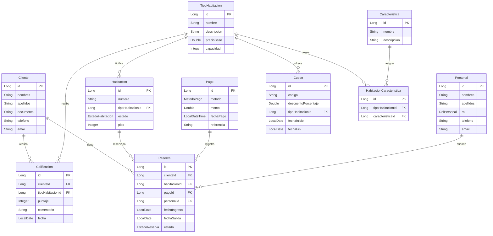

# API Sistema de Reservas - Dubai

Proyecto Spring Boot para gestionar reservas de habitaciones con PostgreSQL, Spring Data JPA, Spring Security y JWT.

## 1. Tecnologias

- Java 21+
- Spring Boot 3.5.x
- Maven
- PostgreSQL
- Spring Data JPA
- Spring Security + JWT
- JUnit 5 + Mockito

## 2. Estructura del Proyecto

```text
src/main/java/com/dubai/dubai/
├── controllers/   # Endpoints REST
├── services/      # Reglas de negocio y validaciones
├── repositories/  # Acceso a datos con Spring Data JPA
├── security/      # Configuracion de Spring Security y JWT
├── dto/           # Requests y responses especificos
└── models/        # Entidades JPA y enums

src/test/java/com/dubai/dubai/
└── controllers/   # Tests unitarios simples de controladores
```

## 3. Modelos y Enums

### Modelos principales

- `Cliente`
- `TipoHabitacion`
- `Habitacion`
- `Personal`
- `Pago`
- `Reserva`
- `Caracteristica`
- `Calificacion`
- `Cupon`
- `HabitacionCaracteristica`
- `Usuario`

### Enums

- `EstadoHabitacion`: `DISPONIBLE`, `OCUPADA`, `MANTENIMIENTO`
- `RolPersonal`: `ADMINISTRADOR`, `CAJERO`
- `MetodoPago`: `EFECTIVO`, `YAPE`, `PLIN`, `TRANSFERENCIA`, `TARJETA`
- `EstadoReserva`: `PENDIENTE`, `CONFIRMADA`, `CANCELADA`, `FINALIZADA`
- `RolUsuario`: `CLIENTE`, `ADMINISTRADOR`, `CAJERO`
- `TipoUsuario`: `CLIENTE`, `PERSONAL`

### Diagrama de Relaciones



## 4. Levantar la API

Antes de levantar la API, crea una base de datos local en PostgreSQL:

```sql
CREATE DATABASE dubai;
```

Configura credenciales en `src/main/resources/application.properties`:

```properties
spring.datasource.url=jdbc:postgresql://localhost:5432/dubai
spring.datasource.username=postgres
spring.datasource.password=postgres
spring.jpa.hibernate.ddl-auto=update
```

### Opcion 1

```bash
mvn spring-boot:run
```

### Opcion 2

```bash
./mvnw spring-boot:run
```

Base URL local:

```text
http://localhost:8080
```

## 5. Documentacion de Endpoints

Todos los endpoints devuelven JSON. Salvo `/api/auth/**`, las rutas requieren JWT:

```http
Authorization: Bearer <token>
```

### 5.0 Autenticacion

- `POST /api/auth/register/cliente` -> registra cliente, crea usuario y devuelve JWT
- `POST /api/auth/register/personal` -> registra personal, crea usuario y devuelve JWT
- `POST /api/auth/login` -> inicia sesion y devuelve JWT

#### Request ejemplo `POST /api/auth/register/cliente`

```json
{
  "nombres": "Ana",
  "apellidos": "Lopez",
  "documento": "12345678",
  "telefono": "999111222",
  "email": "ana@correo.com",
  "password": "secret123"
}
```

#### Request ejemplo `POST /api/auth/register/personal`

```json
{
  "nombres": "Carlos",
  "apellidos": "Ramos",
  "rol": "ADMINISTRADOR",
  "telefono": "987654321",
  "email": "carlos@hotel.com",
  "password": "secret123"
}
```

#### Request ejemplo `POST /api/auth/login`

```json
{
  "email": "ana@correo.com",
  "password": "secret123"
}
```

#### Response auth

```json
{
  "token": "eyJ...",
  "tipo": "Bearer",
  "usuarioId": 1,
  "email": "ana@correo.com",
  "rol": "CLIENTE",
  "tipoUsuario": "CLIENTE"
}
```

### 5.1 Clientes

- `GET /api/clientes` -> lista de clientes
- `GET /api/clientes/{id}` -> cliente por id (`404` si no existe)

### 5.2 Tipos de habitacion

- `GET /api/tipos-habitacion` -> lista de tipos
- `GET /api/tipos-habitacion/{id}` -> tipo por id (`404` si no existe)

### 5.3 Habitaciones

- `GET /api/habitaciones` -> lista de habitaciones
- `GET /api/habitaciones/{id}` -> habitacion por id (`404` si no existe)

### 5.4 Personal

- `GET /api/personal` -> lista de personal
- `GET /api/personal/{id}` -> personal por id (`404` si no existe)

### 5.5 Pagos

- `GET /api/pagos` -> lista de pagos
- `GET /api/pagos/{id}` -> pago por id (`404` si no existe)

### 5.6 Caracteristicas

- `GET /api/caracteristicas` -> lista de caracteristicas
- `GET /api/caracteristicas/{id}` -> caracteristica por id (`404` si no existe)

### 5.7 Calificaciones

- `GET /api/calificaciones` -> lista de calificaciones
- `GET /api/calificaciones/{id}` -> calificacion por id (`404` si no existe)

### 5.8 Cupones

- `GET /api/cupones` -> lista de cupones
- `GET /api/cupones/{id}` -> cupon por id (`404` si no existe)

### 5.9 Relacion Habitacion-Caracteristicas

- `GET /api/habitacion-caracteristicas` -> lista de relaciones
- `GET /api/habitacion-caracteristicas/{id}` -> relacion por id (`404` si no existe)

### 5.10 Reservas

- `GET /api/reservas` -> lista de reservas
- `GET /api/reservas/{id}` -> reserva por id (`404` si no existe)
- `POST /api/reservas` -> crea reserva, valida datos y calcula noches
- `GET /api/reservas/mis-reservas` -> lista reservas del cliente autenticado
- `POST /api/reservas/mis-reservas` -> crea reserva para el cliente autenticado

#### Request ejemplo `POST /api/reservas`

```json
{
  "clienteId": 1,
  "habitacionId": 1,
  "pagoId": 1,
  "personalId": 1,
  "fechaIngreso": "2026-05-10",
  "fechaSalida": "2026-05-12"
}
```

#### Response exitosa (`201`)

```json
{
  "mensaje": "Reserva creada correctamente",
  "noches": 2,
  "reserva": {
    "id": 3,
    "clienteId": 1,
    "habitacionId": 1,
    "pagoId": 1,
    "personalId": 1,
    "fechaIngreso": "2026-05-10",
    "fechaSalida": "2026-05-12",
    "estado": "PENDIENTE"
  }
}
```

#### Response error validacion (`400`)

```json
{
  "error": "La fecha de salida debe ser posterior a la fecha de ingreso"
}
```

## 6. Permisos por Rol

La API usa los roles incluidos en el JWT:

- `ADMINISTRADOR`: acceso total.
- `CAJERO`: acceso operativo a clientes, pagos, reservas, habitaciones y catalogo.
- `CLIENTE`: acceso al catalogo y solo a sus propias reservas.

Resumen de permisos:

| Rol | Acceso principal |
| --- | --- |
| `ADMINISTRADOR` | Todos los endpoints protegidos |
| `CAJERO` | `GET /api/clientes/**`, `GET /api/pagos/**`, `GET /api/reservas/**`, `POST /api/reservas`, catalogo y relaciones |
| `CLIENTE` | Catalogo, calificaciones, `GET /api/reservas/mis-reservas`, `POST /api/reservas/mis-reservas` |

Para crear una reserva propia como cliente:

```json
{
  "habitacionId": 1,
  "pagoId": 1,
  "personalId": 1,
  "fechaIngreso": "2026-05-10",
  "fechaSalida": "2026-05-12"
}
```

El cliente no envia `clienteId`; se toma desde el token.

Ver la matriz completa en `changes/005-permisos-por-roles.md`.

## 7. Reglas Actuales (Servicios)

- Los servicios trabajan con repositorios JPA y PostgreSQL.
- Los controladores delegan en servicios y responden HTTP.
- Las credenciales se gestionan en `Usuario`; `Cliente` y `Personal` quedan como perfiles de negocio.
- Las contrasenas se guardan con BCrypt.
- `JWTAuthorizationFilter` protege todas las rutas excepto `/api/auth/**`.
- `ReservaService` valida:
- `clienteId`, `habitacionId`, `pagoId`, `personalId` obligatorios.
- Que las entidades relacionadas existan en base de datos.
- `fechaIngreso` y `fechaSalida` obligatorias.
- `fechaSalida` debe ser posterior a `fechaIngreso`.
- Se calcula cantidad de noches al crear reserva.

## 8. Verificacion

Compilar sin ejecutar tests:

```bash
./mvnw -DskipTests compile
```

Levantar la API:

```bash
./mvnw spring-boot:run
```
